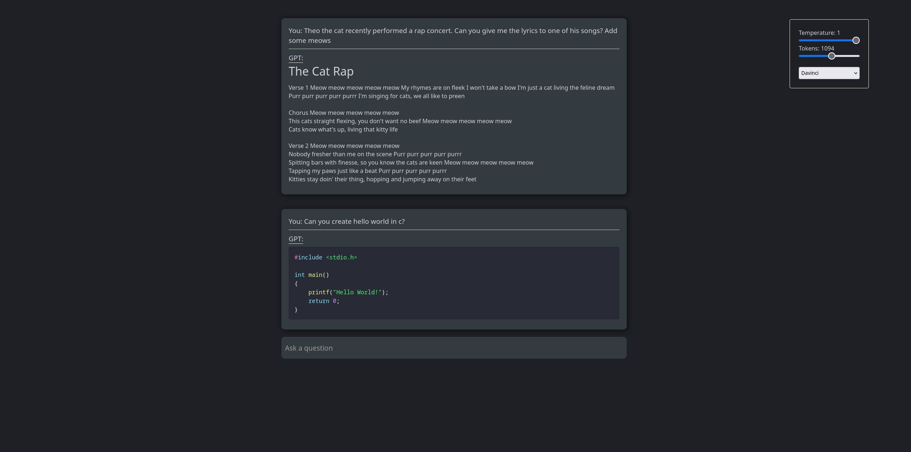

## GPT Chat Bot

This app is built to use the GPT-3 API on a local machine. I was inspired to create
this app after using the official ChatGPT. I was blown away at the clear straight to the point answers I was getting.

This app isn't fully featured yet. I still have a lot of work to do, but it does respond and answer questions well enough that you can avoid having to sort through all the trash click baity websites that google/brave/duckduckgo respond with.

## Issues:

1. I still need to work out a way for it to remember previous questions so that a conversation can continue.
2. Because I'm still pretty new to programming, I don't have a way to separate the responses. For example when you ask for code it sends back text. My workaround was to concatenate to the prompt `Respond in markdown` then use react-markdown to display the response.

## To Do:

1. Add more options to the PromptController
2. Add a toggle switch so the PromptController is a drop down menu instead of it always showing.
3. Make it mobile friendly. Not a top priority though since I just use this in a browser on my desktop.

### To install:

git clone the repo:

```
git clone https://github.com/jas3333/GPT-Helper
cd GPT-Helper/client
npm install && start
```


