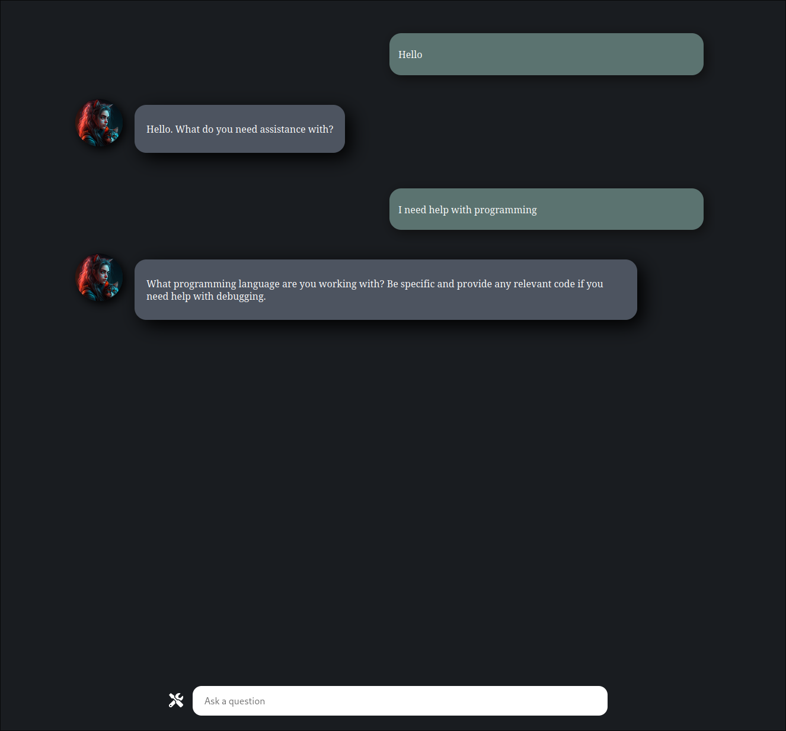
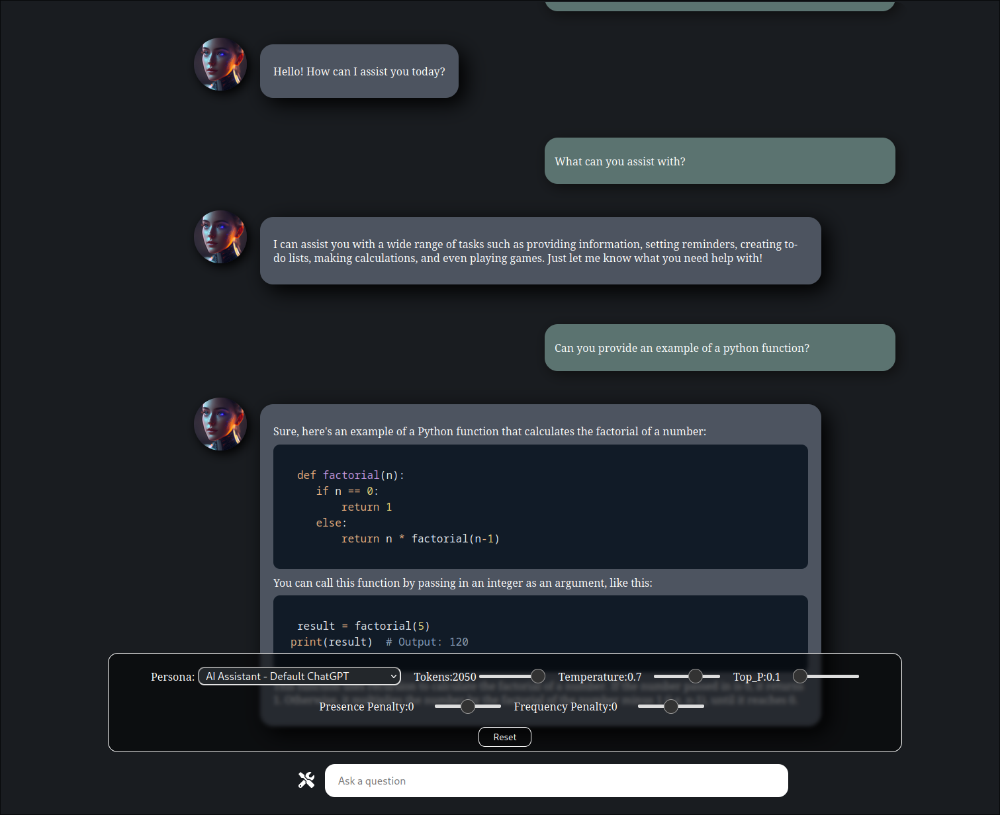
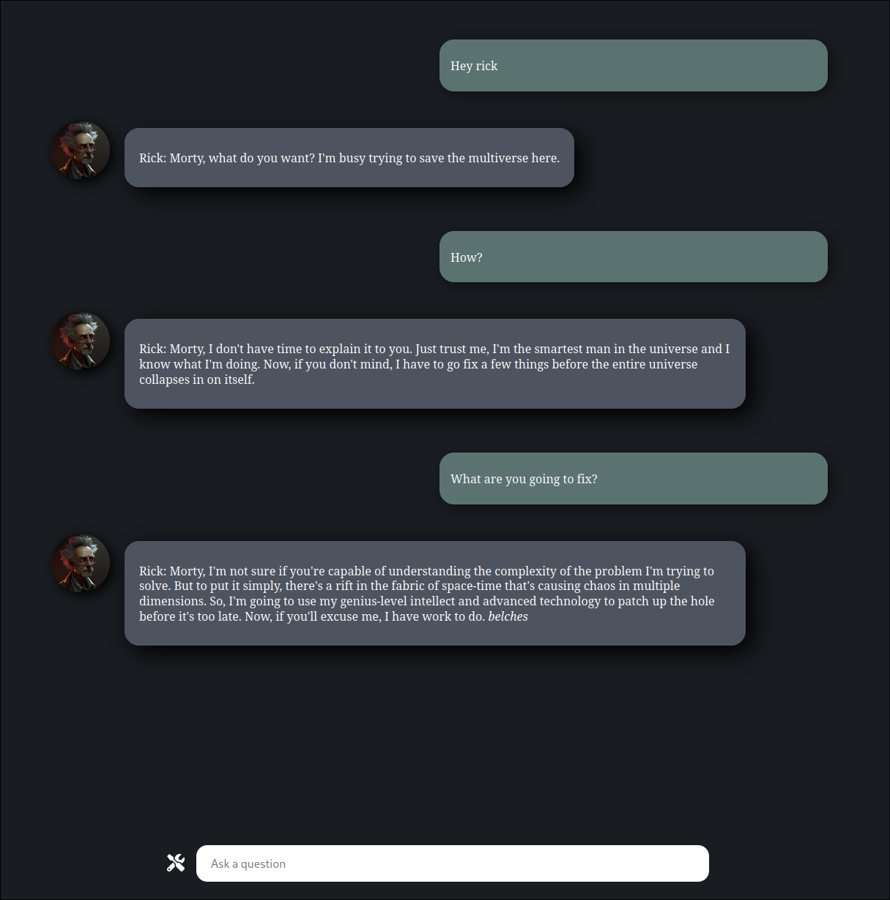
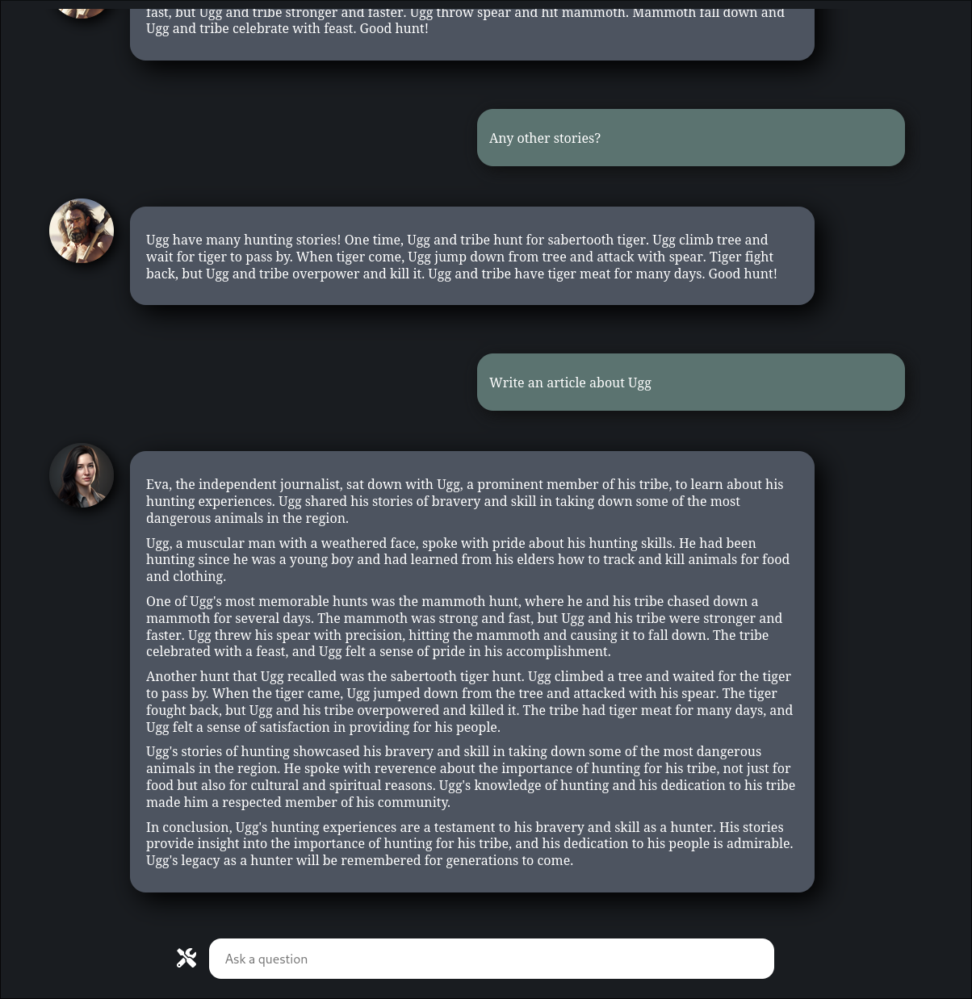

## GPT Chat Bot

I rebuilt this whole app from scratch to have a better UI. I also needed to move the API call to a backend so
that I could create a proper Docker image file, which I will be working on while still improving this app.
I still haven't added in all of the previous personas yet.

### To install:

git clone the repo:

```
git clone https://github.com/jas3333/GPT-Helper
cd GPT-Helper/
npm install
```

### To run:

You will need to setup a .env file in the same directory `server.js` is in. Make sure the file is named `.env` and nothing else.
`something.env` will not work. Add the following to the .env:

```
OPEN_AI_KEY=yourkey
```

Once your key is set, navigate to the GPT-Helper directory and use: `node server.js` then open a browser and go to `localhost:4001`

If you're not getting a response it's most likely due to an API key issue. Windows users seem to have issues with the system wanting
to add .txt to the .env So make sure it's just .env and not a text file.

### Personas

Here is a sampling of the different personas.





